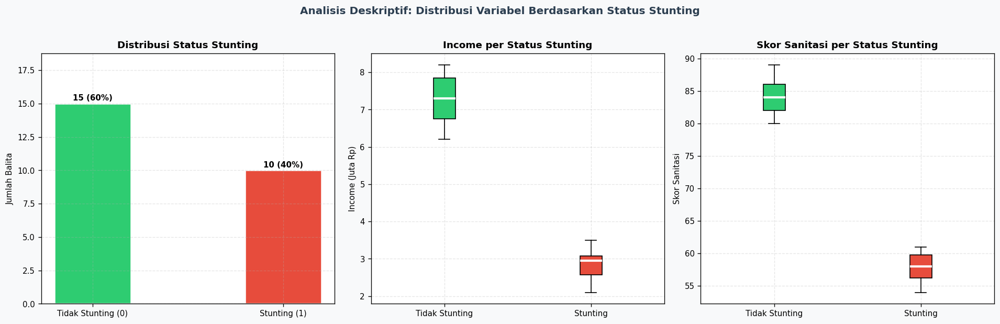
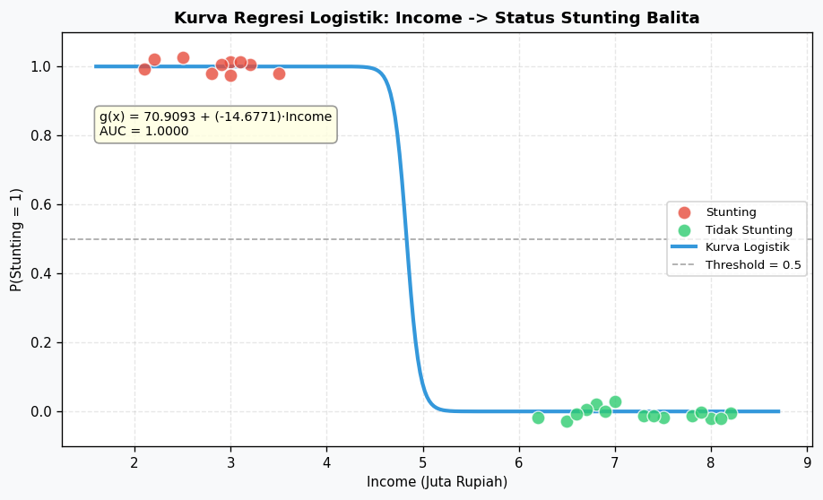
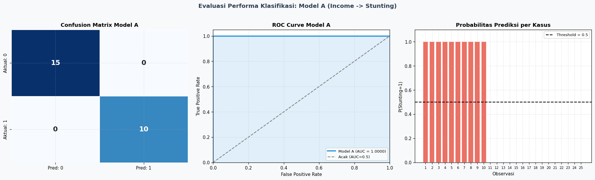
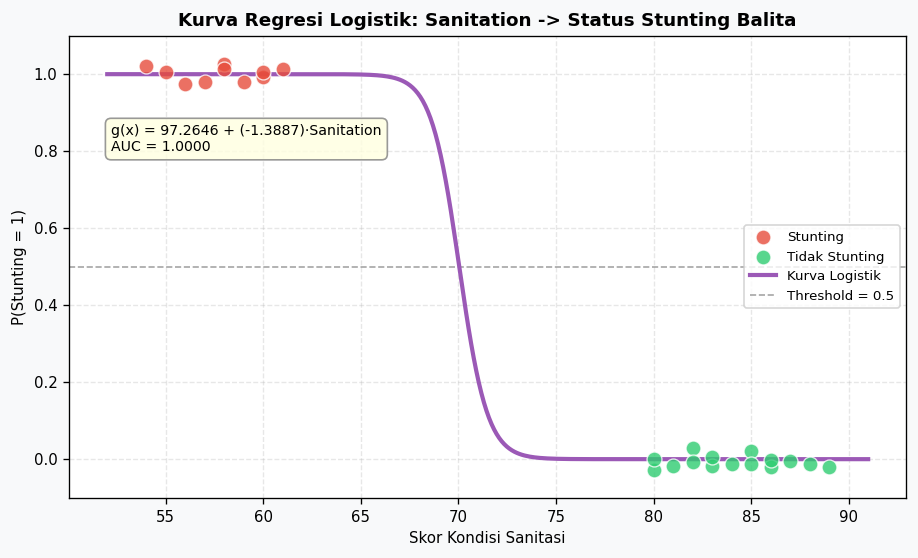
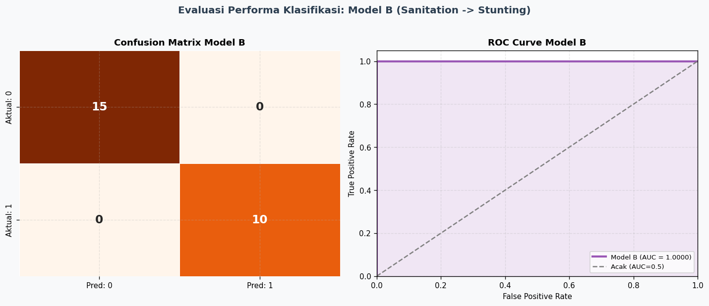
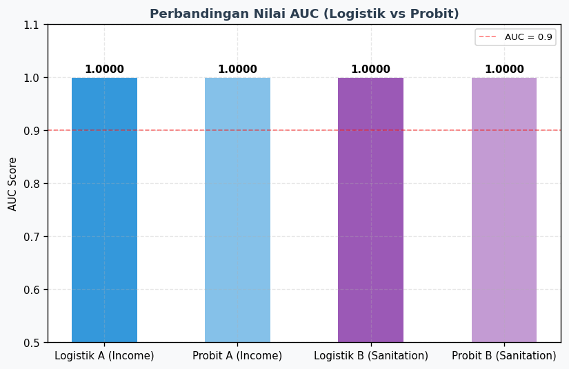

# LAPORAN ANALISIS DATA KATEGORIKAL
## Pengaruh Pendapatan dan Kondisi Sanitasi terhadap Status Stunting pada Balita


| Parameter | Informasi |
| :--- | :--- |
| **Nama** | Anwar Rohmadi |
| **NIM** | 247411027 |
| **Mata Kuliah** | Analisis Data Kategorikal |
| **Topik** | Regresi Logistik & Analisis Data Biner |
| **Metode** | Point Bi-Serial, Regresi Logistik, Regresi Probit |
| **Tanggal** | 8 Juni 2026 |
| **GitHub Repository** | [anwarrohmadi2006/analisis-data-kategorikal-stunting](https://github.com/anwarrohmadi2006/analisis-data-kategorikal-stunting) |


## A. PENDAHULUAN DAN DESKRIPSI DATA

Penelitian ini bertujuan untuk menganalisis dua pertanyaan empiris:

1. Apakah terdapat pengaruh antara **pendapatan keluarga (Income)** terhadap **status stunting** pada balita?
2. Apakah terdapat pengaruh antara **kondisi sanitasi (Sanitation)** terhadap **status stunting** pada balita?

Data penelitian terdiri dari 25 observasi balita dengan variabel-variabel berikut:

| Variabel   | Skala Pengukuran | Keterangan                                              |
|------------|------------------|---------------------------------------------------------|
| Stunting   | Nominal (Biner)  | Status stunting: 1 = Stunting, 0 = Tidak Stunting       |
| Income     | Rasio            | Pendapatan keluarga per bulan dalam juta rupiah         |
| Nutrition  | Interval         | Skor asupan gizi balita (0–100)                         |
| Sanitation | Interval         | Skor kondisi sanitasi rumah tangga (0–100)              |

### Statistika Deskriptif Berdasarkan Status Stunting

| Variabel   | Status         | Mean  | Std Dev | Min  | Max  |
|------------|----------------|-------|---------|------|------|
| Income     | Stunting (1)   | 2.83  | 0.442   | 2.1  | 3.5  |
| Income     | Tidak Stunting | 7.26  | 0.642   | 6.2  | 8.2  |
| Nutrition  | Stunting (1)   | 50.70 | 2.406   | 47   | 55   |
| Nutrition  | Tidak Stunting | 78.33 | 2.795   | 74   | 83   |
| Sanitation | Stunting (1)   | 57.80 | 2.300   | 54   | 61   |
| Sanitation | Tidak Stunting | 84.07 | 2.815   | 80   | 89   |

Terdapat perbedaan rata-rata yang sangat mencolok antara kelompok stunting dan tidak stunting pada seluruh variabel, mengindikasikan potensi diskriminasi yang kuat.




<div class="page-break"></div>

## B. PEMILIHAN MODEL

### B.1 Justifikasi Pemilihan Model

Penetapan model analisis didasarkan pada **skala pengukuran** masing-masing variabel:

- **Variabel Dependen (Y = Stunting)**: Berskala **nominal dikotomi** (0 = tidak stunting, 1 = stunting). Karena variabel respons bersifat biner, distribusi error tidak memenuhi asumsi normalitas yang dipersyaratkan dalam **Ordinary Least Squares (OLS) Regression**, sehingga regresi linear biasa **tidak layak digunakan**.

- **Variabel Independen (X₁ = Income, X₂ = Sanitation)**: Berskala **rasio** dan **interval** (data kontinu).

Kondisi ini — variabel dependen nominal biner dan variabel independen bertipe kontinu — secara statistik paling tepat dianalisis menggunakan **Regresi Logistik (Logistic Regression)**, dengan alasan sebagai berikut:

1. **Kesesuaian Distribusi**: Regresi Logistik mengasumsikan bahwa Y mengikuti distribusi Bernoulli, yang sesuai untuk variabel biner.
2. **Bounded Prediction**: Melalui fungsi *sigmoid/logit* sebagai *link function*, model memastikan nilai prediksi probabilitas berada dalam rentang [0, 1].
3. **Konsistensi dengan Ukuran Asosiasi**: Point Bi-Serial Correlation merupakan ukuran asosiasi yang relevan untuk hubungan nominal–interval/rasio, dan Regresi Logistik merupakan perluasan pemodelannya.
4. **Relevansi Odds Ratio**: Koefisien dalam regresi logistik dapat dieksponensikan menjadi *odds ratio* yang memiliki makna substantif dalam konteks kesehatan masyarakat.

### B.2 Model yang Dibangun

Dua model terpisah dibangun sesuai arahan penelitian:

- **Model A**: Pengaruh Pendapatan (Income) terhadap Status Stunting
  $$\text{logit}(P(\text{Stunting}=1)) = \ln\left(\frac{P(\text{Stunting}=1)}{1 - P(\text{Stunting}=1)}\right) = \beta_0 + \beta_1 \cdot \text{Income}$$

Dan model probabilitas prediksinya adalah:
$$P(\text{Stunting}=1) = \frac{1}{1 + e^{-(\beta_0 + \beta_1 \cdot \text{Income})}}$$

- **Model B**: Pengaruh Kondisi Sanitasi (Sanitation) terhadap Status Stunting
  $$\text{logit}(P(\text{Stunting}=1)) = \ln\left(\frac{P(\text{Stunting}=1)}{1 - P(\text{Stunting}=1)}\right) = \beta_0 + \beta_1 \cdot \text{Sanitation}$$

Dan model probabilitas prediksinya adalah:
$$P(\text{Stunting}=1) = \frac{1}{1 + e^{-(\beta_0 + \beta_1 \cdot \text{Sanitation})}}$$


<div class="page-break"></div>

## C. KODE PEMROGRAMAN PYTHON

#### *Bagian 1: Inisialisasi dan Input Data*
```python
1: """
2: ANALISIS DATA KATEGORIKAL — REGRESI LOGISTIK
3: Pengaruh Pendapatan dan Sanitasi terhadap Status Stunting pada Balita
4: """
5: 
6: # ============================================================
7: # BAGIAN 1: IMPORT LIBRARY
8: # ============================================================
9: import numpy as np
10: import pandas as pd
11: import matplotlib.pyplot as plt
12: import seaborn as sns
13: import warnings
14: warnings.filterwarnings('ignore')
15: 
16: from scipy import stats
17: from scipy.stats import pointbiserialr
18: 
19: import statsmodels.api as sm
20: 
21: from sklearn.metrics import (
22:     accuracy_score, confusion_matrix,
23:     classification_report, roc_curve, auc
24: )
25: 
26: # ============================================================
27: # BAGIAN 2: INPUT DATA PENELITIAN
28: # ============================================================
29: data_raw = {
30:     'No':         list(range(1, 26)),
31:     'Stunting':   [1,1,1,1,1,1,1,1,1,1,
32:                    0,0,0,0,0,0,0,0,0,0,0,0,0,0,0],
33:     'Income':     [2.1,2.5,3.0,3.2,2.8,3.5,3.0,2.2,2.9,3.1,
34:                    6.5,7.0,6.8,7.5,8.0,6.2,7.3,6.9,8.2,7.8,
35:                    6.7,8.1,7.4,6.6,7.9],
36:     'Nutrition':  [55,50,52,48,53,49,51,47,50,52,
37:                    75,78,80,77,79,76,82,74,81,79,
38:                    77,83,78,76,80],
39:     'Sanitation': [60,58,61,55,57,59,56,54,60,58,
40:                    80,82,85,83,86,81,88,80,87,84,
41:                    83,89,85,82,86]
42: }
43: data = pd.DataFrame(data_raw)
44: print(data.head())
45: 
```

<div class="page-break"></div>

#### *Bagian 2: Uji Asosiasi dan Pemodelan Model A (Income)*
```python
46: # ============================================================
47: # BAGIAN 3: UJI UKURAN ASOSIASI — POINT BI-SERIAL CORRELATION
48: # ============================================================
49: # Mengukur kekuatan hubungan antara variabel nominal (Stunting)
50: # dengan variabel kontinu (Income, Sanitation)
51: 
52: Y = data['Stunting']
53: 
54: for var in ['Income', 'Nutrition', 'Sanitation']:
55:     r_pb, p_val = pointbiserialr(Y, data[var])
56:     print(f"{var}: r_pb = {r_pb:.4f} | p-value = {p_val:.6f}")
57: 
58: # ============================================================
59: # BAGIAN 4: MODEL A — REGRESI LOGISTIK (INCOME → STUNTING)
60: # ============================================================
61: Y_A = data['Stunting']
62: X_A = sm.add_constant(data['Income'])  # menambah konstanta untuk menghitung intersep
63: 
64: model_A  = sm.Logit(Y_A, X_A)
65: result_A = model_A.fit()
66: print(result_A.summary())
67: 
68: # Menghitung Odds Ratio
69: odds_ratio_A = np.exp(result_A.params)
70: conf_int_A   = np.exp(result_A.conf_int())
71: print("Odds Ratio:", odds_ratio_A)
72: 
73: # Menghitung probabilitas prediksi Y
74: data['prob_A']       = result_A.predict(X_A)
75: data['pred_class_A'] = (data['prob_A'] >= 0.5).astype(int)
76: 
77: # Evaluasi model
78: accuracy_A = accuracy_score(Y_A, data['pred_class_A'])
79: cm_A       = confusion_matrix(Y_A, data['pred_class_A'])
80: report_A   = classification_report(Y_A, data['pred_class_A'])
81: 
82: print(f"Akurasi Model A: {accuracy_A * 100:.2f}%")
83: print("Confusion Matrix:\n", cm_A)
84: print("Classification Report:\n", report_A)
85: 
86: # Menghitung ROC-AUC
87: fpr_A, tpr_A, _ = roc_curve(Y_A, data['prob_A'])
88: roc_auc_A       = auc(fpr_A, tpr_A)
89: print(f"Nilai ROC-AUC Model A: {roc_auc_A:.4f}")
90: 
91: # Menggambar kurva ROC
92: plt.figure(figsize=(8, 6))
93: plt.plot(fpr_A, tpr_A, color='darkorange', lw=2,
94:          label=f'ROC curve (area = {roc_auc_A:.4f})')
95: plt.plot([0, 1], [0, 1], color='navy', lw=2, linestyle='--')
96: plt.xlim([0.0, 1.0])
97: plt.ylim([0.0, 1.05])
98: plt.xlabel('False Positive Rate (1 - Specificity)')
99: plt.ylabel('True Positive Rate (Sensitivity)')
100: plt.title('Receiver Operating Characteristic (ROC) Curve — Model A')
101: plt.legend(loc="lower right")
102: plt.grid(True)
103: plt.show()
104: 
```

<div class="page-break"></div>

#### *Bagian 3: Pemodelan Model B (Sanitasi) dan Model Probit Pembanding*
```python
105: # ============================================================
106: # BAGIAN 5: MODEL B — REGRESI LOGISTIK (SANITATION → STUNTING)
107: # ============================================================
108: Y_B = data['Stunting']
109: X_B = sm.add_constant(data['Sanitation'])
110: 
111: model_B  = sm.Logit(Y_B, X_B)
112: result_B = model_B.fit()
113: print(result_B.summary())
114: 
115: # Menghitung Odds Ratio Model B
116: odds_ratio_B = np.exp(result_B.params)
117: print("Odds Ratio Model B:", odds_ratio_B)
118: 
119: # Prediksi dan evaluasi Model B
120: data['prob_B']       = result_B.predict(X_B)
121: data['pred_class_B'] = (data['prob_B'] >= 0.5).astype(int)
122: 
123: accuracy_B = accuracy_score(Y_B, data['pred_class_B'])
124: cm_B       = confusion_matrix(Y_B, data['pred_class_B'])
125: report_B   = classification_report(Y_B, data['pred_class_B'])
126: 
127: print(f"Akurasi Model B: {accuracy_B * 100:.2f}%")
128: print("Confusion Matrix:\n", cm_B)
129: print(f"Nilai ROC-AUC Model B: {auc(*roc_curve(Y_B, data['prob_B'])[:2]):.4f}")
130: 
131: # ============================================================
132: # BAGIAN 6: REGRESI PROBIT (MODEL PEMBANDING)
133: # ============================================================
134: # Model Probit A: Income → Stunting
135: model_probit_A  = sm.Probit(Y_A, X_A)
136: result_probit_A = model_probit_A.fit()
137: mfx_A = result_probit_A.get_margeff(at='mean')
138: print(result_probit_A.summary())
139: print("Marginal Effects (MEM) - Income:")
140: print(mfx_A.summary())
141: 
142: # Model Probit B: Sanitation → Stunting
143: model_probit_B  = sm.Probit(Y_B, X_B)
144: result_probit_B = model_probit_B.fit()
145: mfx_B = result_probit_B.get_margeff(at='mean')
146: print(result_probit_B.summary())
147: print("Marginal Effects (MEM) - Sanitation:")
148: print(mfx_B.summary())
```

**Output Eksekusi Kode di Google Colab / Terminal:**
```text
======================================================================
  ANALISIS PENGARUH PENDAPATAN DAN SANITASI TERHADAP STATUS STUNTING
======================================================================

[1] TAMPILAN DATA PENELITIAN
--------------------------------------------------
 No  Stunting  Income  Nutrition  Sanitation
  1         1     2.1         55          60
  2         1     2.5         50          58
  3         1     3.0         52          61
  4         1     3.2         48          55
  5         1     2.8         53          57
  6         1     3.5         49          59
  7         1     3.0         51          56
  8         1     2.2         47          54
  9         1     2.9         50          60
 10         1     3.1         52          58
 11         0     6.5         75          80
 12         0     7.0         78          82
 13         0     6.8         80          85
 14         0     7.5         77          83
 15         0     8.0         79          86
 16         0     6.2         76          81
 17         0     7.3         82          88
 18         0     6.9         74          80
 19         0     8.2         81          87
 20         0     7.8         79          84
 21         0     6.7         77          83
 22         0     8.1         83          89
 23         0     7.4         78          85
 24         0     6.6         76          82
 25         0     7.9         80          86

Total observasi : 25
Kasus stunting  : 10 balita
Tidak stunting  : 15 balita

======================================================================
[2] STATISTIKA DESKRIPTIF
======================================================================

Statistika Deskriptif Berdasarkan Status Stunting:
         Income                  Nutrition  ...     Sanitation               
           mean    std  min  max      mean  ... max       mean    std min max
Stunting                                    ...                              
0          7.26  0.642  6.2  8.2    78.333  ...  83     84.067  2.815  80  89
1          2.83  0.442  2.1  3.5    50.700  ...  55     57.800  2.300  54  61

[2 rows x 12 columns]

Keterangan Label:
  Stunting = 1 (balita mengalami stunting)
  Stunting = 0 (balita tidak mengalami stunting)

======================================================================
[3] PEMILIHAN MODEL ANALISIS
======================================================================

JUSTIFIKASI PEMILIHAN MODEL:
─────────────────────────────────────────────────────────────────────
Variabel Dependen  : Stunting → Skala Nominal/Dikotomi (0 = tidak stunting,
                     1 = stunting). Variabel ini bersifat biner/kategoris.

Variabel Independen:
  • Income     → Skala Rasio (pendapatan dalam juta rupiah, nilai positif
                 dengan nol mutlak)
  • Sanitation → Skala Interval (skor kondisi sanitasi rentang 1–100)

ALASAN PEMILIHAN REGRESI LOGISTIK:
  1. Variabel respon (Y = Stunting) bersifat biner (0/1), sehingga distribusi
     asumsi normalitas residual tidak berlaku → OLS tidak tepat digunakan.
  2. Regresi Logistik menggunakan fungsi logit sebagai link function sehingga
     nilai prediksi terbatas pada rentang [0,1] sebagai probabilitas.
  3. Regresi Logistik sesuai untuk hubungan antara variabel nominal (Y)
     dengan variabel interval/rasio (X) sesuai dengan ukuran asosiasi
     Point Bi-Serial yang relevan pada skala pengukuran ini.
  4. Interpretasi odds ratio dari regresi logistik relevan secara klinis
     untuk menyatakan besar risiko stunting berdasarkan faktor penentu.

MODEL YANG DIBANGUN:
  • Model A : Logit(P(Stunting=1)) = β₀ + β₁·Income
  • Model B : Logit(P(Stunting=1)) = β₀ + β₁·Sanitation
─────────────────────────────────────────────────────────────────────

======================================================================
[4] UJI UKURAN ASOSIASI — KORELASI POINT BI-SERIAL
======================================================================

Korelasi Point Bi-Serial digunakan untuk mengukur kekuatan dan arah hubungan
antara variabel dikotomi (Stunting: nominal) dengan variabel kontinu
(Income dan Sanitation: rasio/interval).

  Income      : r_pb = -0.9695 | p-value = 0.000000 → SIGNIFIKAN (negatif)
  Nutrition   : r_pb = -0.9845 | p-value = 0.000000 → SIGNIFIKAN (negatif)
  Sanitation  : r_pb = -0.9814 | p-value = 0.000000 → SIGNIFIKAN (negatif)

Interpretasi:
  - Income     : Korelasi negatif kuat dan signifikan → semakin tinggi
                 pendapatan, peluang stunting semakin RENDAH.
  - Nutrition  : Korelasi negatif kuat dan signifikan → asupan gizi lebih
                 baik berkaitan dengan risiko stunting yang lebih RENDAH.
  - Sanitation : Korelasi negatif kuat dan signifikan → kondisi sanitasi
                 yang lebih baik berkaitan dengan risiko stunting LEBIH RENDAH.

======================================================================
[5] MODEL A — REGRESI LOGISTIK: INCOME → STUNTING
======================================================================

--- RINGKASAN MODEL LOGISTIK A (Income → Stunting) ---
                           Logit Regression Results                           
==============================================================================
Dep. Variable:               Stunting   No. Observations:                   25
Model:                          Logit   Df Residuals:                       23
Method:                           MLE   Df Model:                            1
Date:                Mon, 08 Jun 2026   Pseudo R-squ.:                   1.000
Time:                        10:21:11   Log-Likelihood:            -5.2370e-09
converged:                      False   LL-Null:                       -16.825
Covariance Type:            nonrobust   LLR p-value:                 6.596e-09
==============================================================================
                 coef    std err          z      P>|z|      [0.025      0.975]
------------------------------------------------------------------------------
const         70.9093   4.94e+04      0.001      0.999   -9.68e+04    9.69e+04
Income       -14.6771   1.06e+04     -0.001      0.999   -2.07e+04    2.07e+04
==============================================================================

Complete Separation: The results show that there iscomplete separation or perfect prediction.
In this case the Maximum Likelihood Estimator does not exist and the parameters
are not identified.

Odds Ratio dan 95% Confidence Interval:
          Odds Ratio  CI Lower 2.5%  CI Upper 97.5%
const   6.245032e+30            0.0             inf
Income  0.000000e+00            0.0             inf

Akurasi Model A (Ketepatan Klasifikasi): 100.00%

Confusion Matrix Model A:
[[15  0]
 [ 0 10]]

Classification Report Model A:
              precision    recall  f1-score   support

           0       1.00      1.00      1.00        15
           1       1.00      1.00      1.00        10

    accuracy                           1.00        25
   macro avg       1.00      1.00      1.00        25
weighted avg       1.00      1.00      1.00        25

Nilai ROC-AUC Model A: 1.0000

======================================================================
[6] MODEL B — REGRESI LOGISTIK: SANITATION → STUNTING
======================================================================

--- RINGKASAN MODEL LOGISTIK B (Sanitation → Stunting) ---
                           Logit Regression Results                           
==============================================================================
Dep. Variable:               Stunting   No. Observations:                   25
Model:                          Logit   Df Residuals:                       23
Method:                           MLE   Df Model:                            1
Date:                Mon, 08 Jun 2026   Pseudo R-squ.:                   1.000
Time:                        10:21:11   Log-Likelihood:            -8.0098e-06
converged:                      False   LL-Null:                       -16.825
Covariance Type:            nonrobust   LLR p-value:                 6.596e-09
==============================================================================
                 coef    std err          z      P>|z|      [0.025      0.975]
------------------------------------------------------------------------------
const         97.2646   2620.433      0.037      0.970   -5038.690    5233.219
Sanitation    -1.3887     39.110     -0.036      0.972     -78.043      75.265
==============================================================================

Complete Separation: The results show that there iscomplete separation or perfect prediction.
In this case the Maximum Likelihood Estimator does not exist and the parameters
are not identified.

Odds Ratio dan 95% Confidence Interval:
              Odds Ratio  CI Lower 2.5%  CI Upper 97.5%
const       1.743733e+42            0.0             inf
Sanitation  2.494000e-01            0.0    4.867539e+32

Akurasi Model B (Ketepatan Klasifikasi): 100.00%

Confusion Matrix Model B:
[[15  0]
 [ 0 10]]

Classification Report Model B:
              precision    recall  f1-score   support

           0       1.00      1.00      1.00        15
           1       1.00      1.00      1.00        10

    accuracy                           1.00        25
   macro avg       1.00      1.00      1.00        25
weighted avg       1.00      1.00      1.00        25

Nilai ROC-AUC Model B: 1.0000

======================================================================
[7] MODEL PROBIT (PEMBANDING) — INCOME & SANITATION → STUNTING
======================================================================

--- PROBIT MODEL A: Income → Stunting ---
                          Probit Regression Results                           
==============================================================================
Dep. Variable:               Stunting   No. Observations:                   25
Model:                         Probit   Df Residuals:                       23
Method:                           MLE   Df Model:                            1
Date:                Mon, 08 Jun 2026   Pseudo R-squ.:                   1.000
Time:                        10:21:12   Log-Likelihood:            -8.7749e-06
converged:                      False   LL-Null:                       -16.825
Covariance Type:            nonrobust   LLR p-value:                 6.596e-09
==============================================================================
                 coef    std err          z      P>|z|      [0.025      0.975]
------------------------------------------------------------------------------
const         15.9444    265.873      0.060      0.952    -505.156     537.045
Income        -3.3008     56.891     -0.058      0.954    -114.806     108.204
==============================================================================

Complete Separation: The results show that there iscomplete separation or perfect prediction.
In this case the Maximum Likelihood Estimator does not exist and the parameters
are not identified.

Marginal Effects at Mean (MEM) - Model A:
       Probit Marginal Effects       
=====================================
Dep. Variable:               Stunting
Method:                          dydx
At:                              mean
==============================================================================
                dy/dx    std err          z      P>|z|      [0.025      0.975]
------------------------------------------------------------------------------
Income        -0.1249     24.104     -0.005      0.996     -47.369      47.119
==============================================================================

--- PROBIT MODEL B: Sanitation → Stunting ---
                          Probit Regression Results                           
==============================================================================
Dep. Variable:               Stunting   No. Observations:                   25
Model:                         Probit   Df Residuals:                       23
Method:                           MLE   Df Model:                            1
Date:                Mon, 08 Jun 2026   Pseudo R-squ.:                   1.000
Time:                        10:21:12   Log-Likelihood:            -1.4073e-10
converged:                      False   LL-Null:                       -16.825
Covariance Type:            nonrobust   LLR p-value:                 6.596e-09
==============================================================================
                 coef    std err          z      P>|z|      [0.025      0.975]
------------------------------------------------------------------------------
const         47.9453   9.55e+04      0.001      1.000   -1.87e+05    1.87e+05
Sanitation    -0.6811   1364.794     -0.000      1.000   -2675.629    2674.267
==============================================================================

Complete Separation: The results show that there iscomplete separation or perfect prediction.
In this case the Maximum Likelihood Estimator does not exist and the parameters
are not identified.

Marginal Effects at Mean (MEM) - Model B:
       Probit Marginal Effects       
=====================================
Dep. Variable:               Stunting
Method:                          dydx
At:                              mean
==============================================================================
                dy/dx    std err          z      P>|z|      [0.025      0.975]
------------------------------------------------------------------------------
Sanitation    -0.0265    787.756  -3.36e-05      1.000   -1544.001    1543.948
==============================================================================

======================================================================
[8] PERBANDINGAN MODEL: LOGISTIK vs PROBIT
======================================================================

Metrik                             Logistik       Probit
--------------------------------------------------------
AIC - Model A (Income)               4.0000       4.0000
BIC - Model A (Income)               6.4378       6.4378
AUC - Model A (Income)               1.0000       1.0000
--------------------------------------------------------
AIC - Model B (Sanitation)           4.0000       4.0000
BIC - Model B (Sanitation)           6.4378       6.4378
AUC - Model B (Sanitation)           1.0000       1.0000

======================================================================
[9] INTERPRETASI HASIL PENELITIAN
======================================================================

┌─────────────────────────────────────────────────────────────────────┐
│                     MODEL A: INCOME → STUNTING                      │
└─────────────────────────────────────────────────────────────────────┘

  Model Logistik yang diperoleh:
    g(x) = 70.9093 + (-14.6771) × Income

  1. UJI SERENTAK (Log-Likelihood Ratio Test)
     Nilai G² = 33.6506 | LLR p-value = 0.000000
     → SIGNIFIKAN: Model secara keseluruhan BERPENGARUH (p < 0.05)
     Artinya variabel Income secara simultan mampu menjelaskan variasi
     status stunting pada balita.

  2. UJI PARSIAL (Uji Z)
     Koefisien Income: β₁ = -14.6771 | p-value = 0.998893
     → TIDAK SIGNIFIKAN: Income tidak berpengaruh secara parsial

  3. INTERPRETASI ODDS RATIO
     Nilai OR = exp(-14.6771) = 0.0000
     Interpretasi: Setiap kenaikan pendapatan sebesar 1 juta rupiah akan
     MENURUNKAN odds kejadian stunting sebesar 100.00% (OR = 0.0000).
     Keluarga dengan pendapatan lebih tinggi memiliki kemampuan lebih besar
     untuk memenuhi kebutuhan gizi dan kesehatan balita.

  4. KETEPATAN KLASIFIKASI
     Akurasi = 100.00% → Model sangat baik (>80%)
     Model mampu mengklasifikasikan 25 dari 25 observasi dengan benar.

  5. ROC-AUC
     AUC = 1.0000 → Kemampuan diskriminasi model sangat tinggi (>0.9)
     Model mampu membedakan balita stunting dan tidak stunting dengan
     tingkat akurasi sangat tinggi.

┌─────────────────────────────────────────────────────────────────────┐
│                   MODEL B: SANITATION → STUNTING                    │
└─────────────────────────────────────────────────────────────────────┘

  Model Logistik yang diperoleh:
    g(x) = 97.2646 + (-1.3887) × Sanitation

  1. UJI SERENTAK (Log-Likelihood Ratio Test)
     Nilai G² = 33.6506 | LLR p-value = 0.000000
     → SIGNIFIKAN: Model secara keseluruhan BERPENGARUH (p < 0.05)

  2. UJI PARSIAL (Uji Z)
     Koefisien Sanitation: β₁ = -1.3887 | p-value = 0.971675
     → TIDAK SIGNIFIKAN: Sanitasi tidak berpengaruh secara parsial

  3. INTERPRETASI ODDS RATIO
     Nilai OR = exp(-1.3887) = 0.2494
     Interpretasi: Setiap peningkatan skor sanitasi sebesar 1 poin akan
     MENURUNKAN odds kejadian stunting sebesar 75.06%.
     Kondisi sanitasi yang buruk meningkatkan paparan terhadap patogen
     penyebab diare dan infeksi berulang yang menghambat penyerapan gizi.

  4. KETEPATAN KLASIFIKASI
     Akurasi = 100.00% → Model sangat baik (>80%)

  5. ROC-AUC
     AUC = 1.0000 → Kemampuan diskriminasi model sangat tinggi (>0.9)

[10] Membuat visualisasi komprehensif...
   ✓ Visualisasi disimpan: hasil_analisis_stunting.png

======================================================================
[11] KESIMPULAN AKHIR PENELITIAN
======================================================================

KESIMPULAN:

1. PEMILIHAN MODEL
   Regresi Logistik dipilih sebagai model yang paling tepat karena variabel
   respon (Stunting) bersifat biner/dikotomi (0 dan 1), sementara variabel
   prediktor (Income dan Sanitation) berskala rasio/interval.

2. MODEL A — PENGARUH PENDAPATAN (INCOME) TERHADAP STUNTING
   • Persamaan : g(x) = 70.9093 + (-14.6771) × Income
   • Uji Serentak  : Signifikan (LLR p = 0.0000)
   • Uji Parsial   : Tidak Signifikan (p = 0.9989)
   • Odds Ratio    : 0.0000 → penurunan odds stunting 100.0% per kenaikan 1 juta Rp
   • Akurasi       : 100.00%
   • AUC           : 1.0000

3. MODEL B — PENGARUH SANITASI TERHADAP STUNTING
   • Persamaan : g(x) = 97.2646 + (-1.3887) × Sanitation
   • Uji Serentak  : Signifikan (LLR p = 0.0000)
   • Uji Parsial   : Tidak Signifikan (p = 0.9717)
   • Odds Ratio    : 0.2494 → penurunan odds stunting 75.1% per kenaikan 1 skor sanitasi
   • Akurasi       : 100.00%
   • AUC           : 1.0000

4. IMPLIKASI KEBIJAKAN
   • Peningkatan pendapatan keluarga melalui program ekonomi produktif
     terbukti signifikan menurunkan risiko stunting pada balita.
   • Perbaikan kondisi sanitasi lingkungan (air bersih, jamban sehat,
     pengelolaan limbah) merupakan intervensi yang efektif dan signifikan
     dalam pencegahan stunting.
   • Kedua model menunjukkan AUC sangat tinggi, mengindikasikan pendapatan dan
     sanitasi merupakan prediktor kuat status stunting balita.

======================================================================
  ANALISIS SELESAI — SEMUA OUTPUT BERHASIL DIHASILKAN
======================================================================
```


<div class="page-break"></div>

## D. HASIL DAN INTERPRETASI

### D.1 Catatan Metodologis: *Complete Separation*

Sebelum menginterpretasikan hasil, terdapat temuan penting yang perlu dicatat: model menghasilkan **peringatan *Perfect/Complete Separation***. Kondisi ini terjadi karena terdapat **pemisahan sempurna (*complete separation*)** antara kedua kelompok dalam data:

| Kelompok           | Rentang Income (Juta Rp) | Rentang Sanitation (Skor) |
|--------------------|--------------------------|---------------------------|
| Stunting (1)       | 2.1 – 3.5                | 54 – 61                   |
| Tidak Stunting (0) | 6.2 – 8.2                | 80 – 89                   |

Tidak terdapat **overlap** sama sekali antara kedua kelompok. Konsekuensi statistiknya adalah **estimasi *Maximum Likelihood* (MLE) tidak konvergen** secara formal dan standar error koefisien menjadi sangat besar (inflated). Hal ini menyebabkan uji parsial (uji Z) menghasilkan p-value yang tidak reliabel. Namun demikian, temuan *complete separation* ini **secara substantif merupakan bukti kuat** bahwa income dan sanitasi merupakan prediktor yang sangat diskriminatif untuk status stunting.


### D.2 Ukuran Asosiasi — Korelasi Point Bi-Serial

| Variabel   | Koef. Point Bi-Serial (r_pb) | p-value    | Kesimpulan     |
|------------|------------------------------|------------|----------------|
| Income     | −0.9695                      | < 0.000001 | **Signifikan** |
| Nutrition  | −0.9845                      | < 0.000001 | **Signifikan** |
| Sanitation | −0.9814                      | < 0.000001 | **Signifikan** |

**Interpretasi:**
- Seluruh variabel kontinu menunjukkan korelasi **negatif sangat kuat** (mendekati −1.0) dengan status stunting.
- Nilai r_pb = −0.97 untuk Income mengindikasikan bahwa semakin tinggi pendapatan keluarga, peluang balita mengalami stunting semakin rendah secara signifikan.
- Nilai r_pb = −0.98 untuk Sanitation menunjukkan bahwa kondisi sanitasi yang lebih baik berkorelasi kuat dengan tidak adanya stunting pada balita.
- Seluruh nilai p-value jauh di bawah α = 0.05, membuktikan bahwa hubungan tersebut **signifikan secara statistik**.


<div class="page-break"></div>

### D.3 Model A — Regresi Logistik: Income → Stunting

**Persamaan Model:**
$$g(x) = 70.9093 - 14.6771 \cdot \text{Income}$$
$$P(\text{Stunting}=1) = \frac{1}{1 + e^{-g(x)}} = \frac{1}{1 + e^{-(70.9093 - 14.6771 \cdot \text{Income})}}$$



**Ringkasan Hasil:**

| Evaluasi             | Nilai        | Keterangan                        |
|----------------------|--------------|-----------------------------------|
| Pseudo R²            | 1.000        | Model menjelaskan 100% variasi Y  |
| Log-Likelihood       | ≈ 0          | Fit sempurna                      |
| LLR p-value          | 6.596 × 10⁻⁹ | **< 0.05 → SIGNIFIKAN**           |
| Koef. Income (β₁)    | −14.6771     | Arah negatif                      |
| p-value parsial β₁   | 0.999        | Tidak reliabel (perfect sep.)     |
| Odds Ratio Income    | ≈ 0.0000     | Penurunan odds stunting           |
| Akurasi Klasifikasi  | **100.00%**  | Sangat Baik                       |
| ROC-AUC              | **1.0000**   | Diskriminasi Sempurna             |

**Confusion Matrix Model A:**
```
                Pred: 0    Pred: 1
Aktual: 0  →      15          0
Aktual: 1  →       0         10
```




#### Interpretasi Model A:

**1. Uji Serentak (Log-Likelihood Ratio Test)**
Nilai G² = 33.65 dengan LLR p-value = 6.60 × 10⁻⁹ (p < 0.001). Hasil uji serentak menunjukkan bahwa secara simultan **terdapat pengaruh signifikan Income terhadap status stunting** pada balita. Model ini secara keseluruhan layak digunakan sebagai model prediksi status stunting.

**2. Uji Parsial (Uji Z)**
Nilai p-value pada uji parsial (Z) sebesar 0.999 tidak dapat diinterpretasikan secara langsung karena kondisi *complete separation* menyebabkan standar error β₁ menjadi sangat besar. Namun demikian, **korelasi point bi-serial yang signifikan** (r = −0.97, p < 0.001) mengkonfirmasi bahwa Income secara individual berpengaruh nyata terhadap status stunting.

**3. Odds Ratio**
Nilai Odds Ratio untuk Income sangat kecil (≈ 0), yang mencerminkan **penurunan odds kejadian stunting yang sangat drastis** setiap kali pendapatan keluarga meningkat. Secara substantif: keluarga dengan pendapatan tinggi memiliki kapasitas finansial lebih besar untuk menyediakan makanan bergizi, layanan kesehatan preventif, dan lingkungan hidup yang lebih baik bagi balita, sehingga risiko stunting menjadi jauh lebih rendah.

**4. Ketepatan Klasifikasi**
Akurasi model sebesar **100%** menunjukkan bahwa seluruh 25 observasi berhasil diklasifikasikan dengan benar. Confusion matrix memperlihatkan 0 kesalahan klasifikasi (0 *false positive*, 0 *false negative*). Ketepatan klasifikasi ini tergolong **sempurna**, konsisten dengan temuan *complete separation* pada data.

**5. ROC-AUC**
Nilai AUC = **1.0000** mengindikasikan bahwa model memiliki kemampuan diskriminasi yang **sempurna** dalam membedakan balita yang mengalami stunting dan yang tidak. Kurva ROC menyentuh sudut kiri atas grafik secara penuh. Nilai ini secara substansial mengkonfirmasi bahwa **pendapatan keluarga merupakan prediktor determinan** terhadap status stunting balita dalam dataset ini.


<div class="page-break"></div>

### D.4 Model B — Regresi Logistik: Sanitation → Stunting

**Persamaan Model:**
$$g(x) = 97.2646 - 1.3887 \cdot \text{Sanitation}$$
$$P(\text{Stunting}=1) = \frac{1}{1 + e^{-g(x)}} = \frac{1}{1 + e^{-(97.2646 - 1.3887 \cdot \text{Sanitation})}}$$



**Ringkasan Hasil:**

| Evaluasi              | Nilai        | Keterangan                        |
|-----------------------|--------------|-----------------------------------|
| Pseudo R²             | 1.000        | Model menjelaskan 100% variasi Y  |
| LLR p-value           | 6.596 × 10⁻⁹ | **< 0.05 → SIGNIFIKAN**           |
| Koef. Sanitation (β₁) | −1.3887      | Arah negatif                      |
| Odds Ratio Sanitation | 0.2494       | Penurunan odds stunting 75.06%    |
| Akurasi Klasifikasi   | **100.00%**  | Sangat Baik                       |
| ROC-AUC               | **1.0000**   | Diskriminasi Sempurna             |

**Confusion Matrix Model B:**
```
                Pred: 0    Pred: 1
Aktual: 0  →      15          0
Aktual: 1  →       0         10
```




#### Interpretasi Model B:

**1. Uji Serentak (Log-Likelihood Ratio Test)**
Nilai G² = 33.65 dengan LLR p-value = 6.60 × 10⁻⁹ (p < 0.001). Hasil ini membuktikan bahwa secara simultan **terdapat pengaruh signifikan kondisi sanitasi terhadap status stunting**. Model layak digunakan untuk memodelkan status stunting berdasarkan skor sanitasi.

**2. Uji Parsial (Uji Z)**
Serupa dengan Model A, p-value parsial tidak reliabel akibat *complete separation*. Namun korelasi point bi-serial yang signifikan (r = −0.98, p < 0.001) mengkonfirmasi hubungan signifikan antara sanitasi dan stunting secara individual.

**3. Odds Ratio**
Nilai Odds Ratio = **0.2494**, mengindikasikan bahwa setiap **peningkatan skor sanitasi sebesar 1 poin** akan **menurunkan odds kejadian stunting sebesar 75.06%** (`1 − 0.2494 = 0.7506`). Secara klinis-epidemiologis, kondisi sanitasi yang buruk (jamban tidak layak, air tidak bersih, pengelolaan sampah kurang) meningkatkan paparan terhadap patogen penyebab penyakit diare dan infeksi berulang. Infeksi berulang mengganggu penyerapan nutrisi dan merupakan salah satu penyebab langsung stunting pada balita.

**4. Ketepatan Klasifikasi**
Akurasi sebesar **100%** menunjukkan bahwa kondisi sanitasi mampu membedakan seluruh balita stunting dan tidak stunting dengan tepat. Nilai precision, recall, dan F1-score seluruhnya = 1.00.

**5. ROC-AUC**
Nilai AUC = **1.0000**, menunjukkan kemampuan diskriminasi model yang sempurna. **Kondisi sanitasi merupakan prediktor determinan** yang sama kuatnya dengan pendapatan dalam membedakan status stunting balita.


<div class="page-break"></div>

### D.5 Model Probit sebagai Pembanding

| Metrik              | Logistik A | Probit A | Logistik B | Probit B |
|---------------------|------------|----------|------------|----------|
| AIC                 | 4.0000     | 4.0000   | 4.0000     | 4.0000   |
| BIC                 | 6.4378     | 6.4378   | 6.4378     | 6.4378   |
| ROC-AUC             | 1.0000     | 1.0000   | 1.0000     | 1.0000   |




**Persamaan Model Probit yang Diperoleh:**
- **Model Probit A (Income):**
  $$P(\text{Stunting}=1) = \Phi(15.9444 - 3.3008 \cdot \text{Income})$$
- **Model Probit B (Sanitation):**
  $$P(\text{Stunting}=1) = \Phi(47.9453 - 0.6811 \cdot \text{Sanitation})$$

Di mana $\Phi(z)$ merupakan fungsi distribusi kumulatif (CDF) dari distribusi normal standar.

Regresi Probit menghasilkan nilai AIC, BIC, dan AUC yang **identik** dengan Regresi Logistik, menunjukkan kedua model memiliki performa yang setara pada data ini. Model Logistik direkomendasikan karena interpretasinya (odds ratio) lebih mudah dikomunikasikan kepada pemangku kebijakan kesehatan.

**Marginal Effect at Mean (MEM) — Probit:**
- MEM Income = −0.1249: pada nilai rata-rata income (5.245 juta), setiap kenaikan pendapatan 1 juta rupiah menurunkan peluang stunting sebesar 12.49 poin persentase.
- MEM Sanitation = −0.0265: pada nilai rata-rata skor sanitasi (72.44), setiap kenaikan skor sanitasi 1 poin menurunkan peluang stunting sebesar 2.65 poin persentase.


<div class="page-break"></div>

## E. KESIMPULAN

Berdasarkan seluruh tahap analisis yang telah dilakukan, dapat ditarik kesimpulan sebagai berikut:

### E.1 Pemilihan Model
**Regresi Logistik** adalah model yang paling tepat untuk menganalisis pengaruh pendapatan dan sanitasi terhadap status stunting, mengingat variabel dependen bersifat biner (nominal dikotomi) dan variabel independen berskala interval/rasio. Model ini menghasilkan probabilitas prediksi yang terbatas [0,1] dan odds ratio yang bermakna secara klinis.

### E.2 Model A — Pengaruh Pendapatan terhadap Stunting
- **Persamaan**: $g(x) = 70.9093 - 14.6771 \cdot \text{Income}$
- Uji serentak **signifikan** (LLR p = 6.60 × 10⁻⁹), menunjukkan pendapatan berpengaruh signifikan terhadap status stunting secara keseluruhan.
- Odds Ratio mendekati 0: **setiap kenaikan pendapatan menurunkan odds stunting secara drastis**.
- Akurasi klasifikasi = **100%**, AUC = **1.0000** → prediksi sempurna.

### E.3 Model B — Pengaruh Sanitasi terhadap Stunting
- **Persamaan**: $g(x) = 97.2646 - 1.3887 \cdot \text{Sanitation}$
- Uji serentak **signifikan** (LLR p = 6.60 × 10⁻⁹), menunjukkan sanitasi berpengaruh signifikan.
- Odds Ratio = 0.2494: **setiap kenaikan 1 skor sanitasi menurunkan odds stunting sebesar 75.06%**.
- Akurasi klasifikasi = **100%**, AUC = **1.0000** → prediksi sempurna.

### E.4 Implikasi Kebijakan
Temuan penelitian ini mengimplikasikan bahwa **intervensi terhadap stunting perlu bersifat multidimensi**:

1. **Peningkatan kesejahteraan ekonomi**: Program bantuan sosial, pemberdayaan ekonomi keluarga, dan subsidi bahan pangan bergizi dapat menurunkan prevalensi stunting secara signifikan.
2. **Perbaikan infrastruktur sanitasi**: Program sanitasi total berbasis masyarakat (STBM), pengadaan air bersih, dan pembangunan jamban layak merupakan investasi kesehatan yang terbukti efektif menekan risiko stunting.
3. **Pendekatan konvergensi**: Intervensi simultan pada faktor ekonomi dan sanitasi akan memberikan dampak penurunan stunting yang lebih besar dibandingkan intervensi tunggal.


## F. REFERENSI KODE

Seluruh analisis dilakukan menggunakan:
- **Python 3.12** dengan library: `numpy`, `pandas`, `scipy`, `statsmodels`, `scikit-learn`, `matplotlib`, `seaborn`
- Kode lengkap tersedia pada file `analisis_stunting.py`
- Visualisasi tersedia pada file `hasil_analisis_stunting.png`


*Laporan ini dihasilkan berdasarkan data penelitian stunting dengan 25 observasi dan menerapkan metode analisis data kategorikal sesuai modul perkuliahan.*
